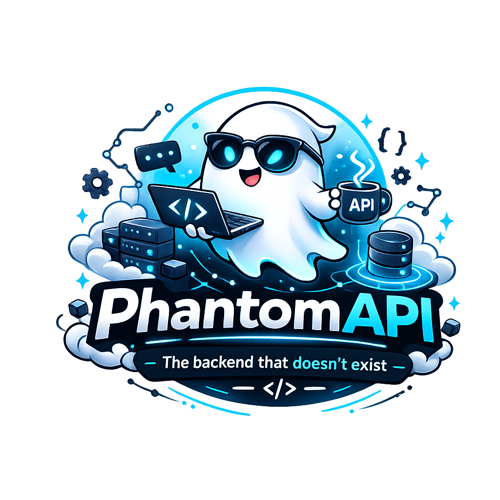

# PhantomAPI

**Documentation-Driven, AI-Native, Autonomous Backend Framework**

PhantomAPI is an instruction-defined backend platform for teams that want to externalize application behavior, operational policy, and interface contracts into a structured documentation layer.

The runtime stays intentionally thin.
The framework surface stays explicit.
The application model stays package-oriented.
The orchestration intelligence lives where the platform expects it to live: in the instruction system.

## Elevator Pitch

PhantomAPI positions itself as:

- a documentation-native backend platform
- an instruction-first application framework
- a multi-app autonomous execution runtime
- a contract-disciplined AI orchestration layer
- an observability-rich backend operating model
- a dynamic API surface for agent-mediated software systems

The core premise is simple:
define the framework precisely, package each application coherently, enforce contracts aggressively, and let the runtime execute from that declared system of truth.

## Why Teams Look At It

- collapse behavioral intent, policies, and interface expectations into a single package model
- reduce controller and service sprawl behind a stable gateway surface
- standardize how apps expose contracts, storage rules, and operational posture
- enable one runtime to host many distinct application packages
- make observability, governance, and response discipline part of the framework itself

## Core Value Proposition

```text
Traditional backend:
code defines behavior, docs explain after the fact

PhantomAPI:
instructions define behavior, runtime executes, contracts verify
```

## Core Architecture

```text
Client JSON
    |
    v
+---------------------------+
| POST /dynamic-api         |
| raw request ingress       |
+-------------+-------------+
              |
              v
+---------------------------+
| PhantomAPI Framework      |
| engine + governance       |
| contracts + observability |
+-------------+-------------+
              |
      app + endpoint routing
              |
              v
+---------------------------+
| App Package               |
| app + entities + rules    |
| endpoints + storage       |
+-------------+-------------+
              |
              v
+---------------------------+
| Codex CLI Runtime         |
| resolve, decide, act      |
+-------------+-------------+
              |
              v
+---------------------------+
| JSON response             |
| logs + traces + metrics   |
| audit + request ledger    |
+---------------------------+
```

## Platform Claims

PhantomAPI is designed to look and behave like a real backend platform:

- one gateway surface
- one framework operating model
- many application packages
- explicit contract ownership
- explicit storage interpretation
- explicit runtime governance
- explicit observability outputs
- explicit error semantics

The platform does not hide where its behavior comes from.
It formalizes that behavior in a framework layer and expects apps to plug into it.

Framework instruction files live under `instructions/framework`.

## Framework Capabilities

The framework currently defines:

- multi-app routing through `app` plus `endpoint`
- app capability manifests
- framework-level routing failure contracts
- endpoint-owned response contracts
- strict output validation at the API boundary
- endpoint-level authentication and authorization rules
- app-local rate-limit policies
- correlation-id aware request handling
- idempotency-key preservation conventions
- request-governance and error-policy rules
- request-ledger output
- audit event output
- logs, traces, metrics, and incident surfaces
- recovery and repair conventions
- explicit write discipline around state mutation
- capability-driven package interpretation
- framework-owned operational vocabulary

## Reliability And Governance Posture

PhantomAPI is documented and presented as a resilient runtime surface, not a loose automation wrapper.

- contract validation at the API boundary
- framework-owned routing failure contracts
- correlation-id aware request processing
- app-scoped rate-limit interpretation
- app-scoped storage and write discipline
- audit and ledger outputs for operational review
- repair and incident conventions for degraded paths
- reusable generic security semantics across all apps

## Responsibility Model

```text
Framework owns: runtime behavior and operational policy
App owns:       domain behavior and response contracts
API owns:       transport and output guardrails
```

## Multi-App Model

PhantomAPI is organized as:

- `instructions/framework`
  cross-app runtime conventions
- `instructions/apps/<app>`
  one concrete software system
- `data/apps/<app>`
  app runtime state
- `data/framework/*`
  shared observability and operational outputs

Current app packages:

- `bank-api`
  authentication, balance query, deposit, withdrawal, transfer, account state handling
- `task-board`
  authentication, task listing, task creation, task lifecycle handling

App-local example requests live with the package itself:

- `instructions/apps/bank-api/.examples/*.json`
- `instructions/apps/task-board/.examples/*.json`

## Request Lifecycle

```text
1. Client submits raw JSON with app and endpoint
2. API forwards request body unchanged to the runtime path
3. Framework resolves the target package and endpoint contract
4. Codex CLI reads the framework and app instructions
5. Runtime resolves state, applies policy, and performs the operation
6. API validates the output against the endpoint contract
7. Response and operational signals are emitted together
```

## Observability Model

The framework defines a first-class operational surface:

- `data/framework/logs/agent.log`
- `data/framework/traces/events.jsonl`
- `data/framework/metrics/counters.json`
- `data/framework/audit/security.jsonl`
- `data/framework/requests/ledger.jsonl`
- `data/framework/incidents/open.json`

Representative outputs:

```text
2026-03-14T13:33:59Z app=bank-api endpoint=auth/login result=success correlationId=9dcfc751461a43b187bd59738c5f1cfd detail="login succeeded"
```

```json
{"timestamp":"2026-03-14T13:36:35Z","app":"bank-api","endpoint":"bank/get-balance","result":"success","correlationId":"4c599fd2b0294f7b872b3a5f9964906a","durationMs":812,"stepSummary":"resolved active session and returned current balance"}
```

```json
{"timestamp":"2026-03-14T13:37:58Z","app":"unknown-app","endpoint":"any/test","correlationId":"2b70f714e55647a5b3c853afa8ecce83","eventType":"routing_failure","actor":"anonymous","result":"failure"}
```

```json
{"totalRequests":6,"successfulRequests":5,"failedRequests":1,"rateLimitFailures":0,"authFailures":0,"storageFailures":0}
```

## Engineering Positioning

PhantomAPI is built to communicate the traits engineering teams usually expect from a serious runtime platform:

- strong contract discipline
- explicit operational governance
- package-based application composition
- centralized observability surfaces
- reusable framework semantics across many apps
- dynamic AI-supported backend execution

That combination makes it suitable for:

- rapid backend prototyping with package-level structure
- internal platform programs around AI-mediated runtime execution
- instruction-driven service packaging
- dynamic API systems with explicit contracts and observable operations

## Additional Docs

- `docs/positioning.md`
  product framing, differentiation, and platform thesis
- `docs/use-cases.md`
  delivery patterns and system examples
- `docs/operating-model.md`
  runtime ownership and lifecycle model
- `docs/framework-features.md`
  full framework capability surface
- `docs/observability.md`
  logging, tracing, metrics, audit, and incident model

## Configuration

Environment variables:

- `Phantom__CliCommand`
  default is `codex.cmd` on Windows and `codex` elsewhere
- `Phantom__CliArgumentsTemplate`
  default is `--dangerously-bypass-approvals-and-sandbox exec --skip-git-repo-check --output-last-message {output} -`
- `Phantom__CliTimeoutSeconds`
  default is `300`

## Quick Start

```bash
dotnet run
```

PowerShell example:

```powershell
Invoke-RestMethod -Method Post -Uri http://localhost:5000/dynamic-api `
  -ContentType "application/json" `
  -Body (Get-Content instructions/apps/bank-api/.examples/login.json -Raw)
```

<sub>PhantomAPI was also created to explore documentation-centric AI system design as a serious engineering medium. That secondary goal does not change the framework model described above.</sub>
